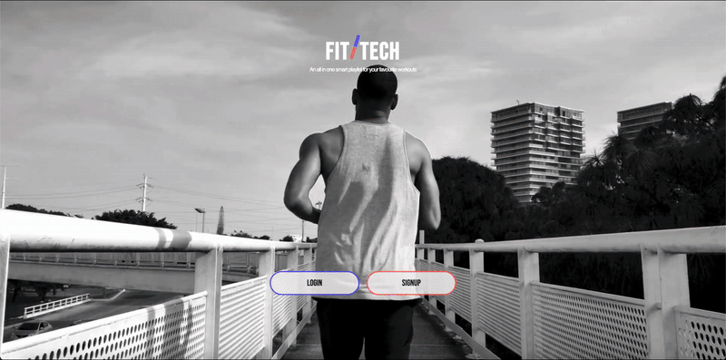

# FitTech 🏋️‍♂️ (Fullstack Fitness Application)

**Project's Backend:** https://github.com/FiorenNathasia/thrivevibe-backend

### 💻 Desktop View

### 📱 Mobile View

---

## 🧠 Overview

**FitTech** is a full-stack fitness application designed to help users create, manage, and follow workout videos anytime, anywhere.

A key feature is its AI-powered tool that converts YouTube workout videos into step-by-step guides, enabling users to follow routines without watching full videos. This is especially useful in low-connectivity environments like gyms or during travel.

---

## 🔍 How is it done?

- Extracts video transcripts from YouTube
- Uses OpenAI’s ChatGPT to generate structured JSON representing workout steps
- Frontend renders this JSON into readable, step-by-step routines
- Includes workout favouriting and a responsive design for cross-device access

---

## 🚀 Features

- 💬 **AI-Generated:** Get custom workout step by step instructions via ChatGPT.
- 📱 **Responsive Design:** Optimized for both mobile and desktop devices.
- 📊 **PostgreSQL Backend:** Efficient and scalable data handling.
- ⚡ **Fast & Intuitive UI:** Built with React for smooth interaction and routing.

---

## 🛠️ Tech Stack

- **Frontend:** React (with responsive design)
- **Backend:** Express.js
- **Database:** PostgreSQL
- **AI Integration:** OpenAI ChatGPT API
- **Authentication:** JWT (OAuth)

---
